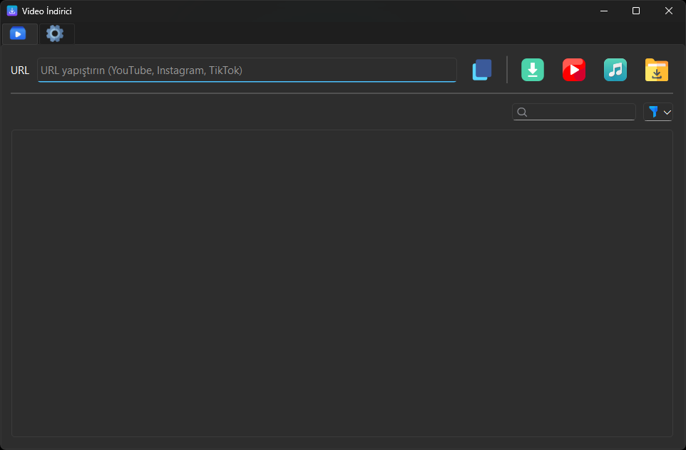

# Video İndirici

YouTube, İnstagram ve Tiktok ve benzeri sitelerden 'video' / ses indirmenizi sağlayan basit, modern bir masaüstü uygulaması.  
Arayüz **PySide6**, indirme altyapısı ise **`yt-dlp`** üzerine kuruludur.

## Özellikler

- YouTube ve çok sayıda site desteği (yt-dlp altyapısı)
- MP4 video, MP3 ses ya da “en iyi kalite” indirme seçenekleri
- Çoklu indirme listesi ve her indirme için durum takibi
- İndirme ilerleme çubuğu ve yüzde gösterimi
- Varsayılan indirme klasörünü kullanıcıya özel olarak kaydetme
- Kullanıcı dostu, ikonlarla zenginleştirilmiş arayüz
- Sistem Temasına uygun olarak Dark/Light tema geçişi

## Ekran Görüntüleri



> Bu projede kullanılan ikonlar **Flaticon** (https://www.flaticon.com) üzerinden temin edilmiştir.  
> İkonlar yalnızca kişisel ve ticari olmayan amaçlarla kullanılmaktadır.

## Gereksinimler

- Python 3.10+ (önerilen)
- `pip` kurulu olmalı

Gerekli Python paketleri:

```bash
pip install -r requirements.txt
```

İsterseniz önce sanal ortam (virtualenv) oluşturabilirsiniz:

```bash
python -m venv .venv
.\.venv\Scripts\activate    # Windows
# veya
source .venv/bin/activate  # macOS / Linux

pip install -r requirements.txt
```

## Çalıştırma

Proje klasöründe aşağıdaki komutlardan birini çalıştırın:

```bash
python app.py
```

Windows’ta bazen `python` yerine `py` kullanmanız gerekebilir:

```bash
py app.py
```

Uygulama açıldıktan sonra:

1. İndirmek istediğiniz videonun URL’sini ilgili alana yapıştırın.
2. İndirme türünü seçin (Kalite, MP4 veya MP3).
3. İlerlemeyi listeden ve ilerleme çubuğundan takip edin.
5. İndirme tamamlandığında dosyayı listede ve indirme klasörünüzde bulabilirsiniz.

## Ayarlar

Uygulama ilk açıldığında otomatik olarak varsayılan
`Downloads` klasörünüz (örneğin `C:\Users\KullanıcıAdı\Downloads`) kullanılır.

Arayüzden indirilecek klasörü değiştirdiğinizde bu tercih `settings.json` içine
kaydedilir ve bir sonraki açılışta aynı klasör kullanılır.
